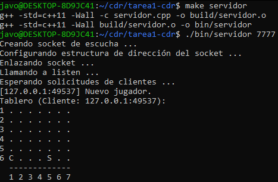
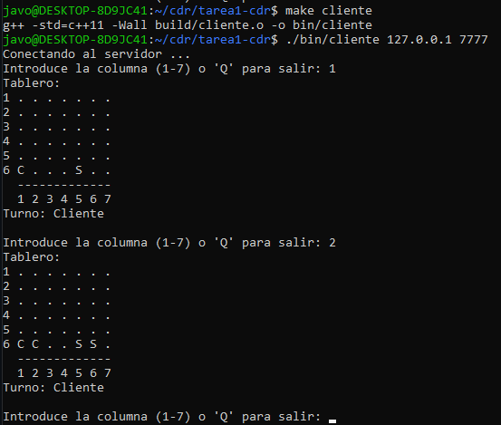

## Compilación y Ejecución Servidor

`make servidor`

`./bin/servidor 7777`, donde el argumento (7777) es el puerto del servidor

## Compilación y Ejecución Cliente

`make cliente`

`./bin/cliente 127.0.0.1 7777`, donde el primer argumento (127.0.0.1) es la ip del servidor y el segundo (7777) es el puerto

